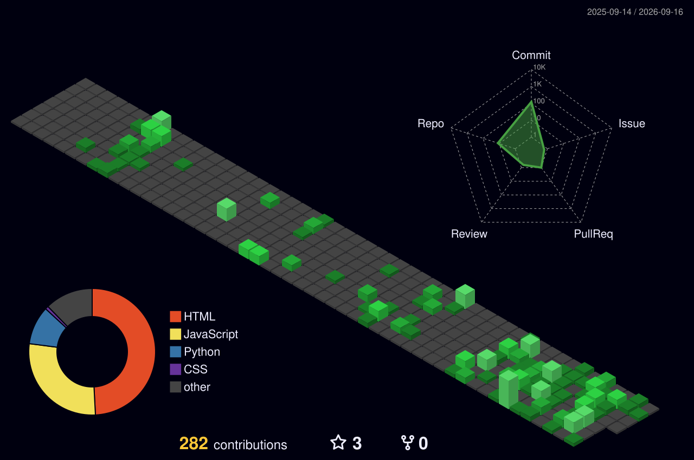

<div align="center">



<br/>

[](https://github.com/mohammed-tousif)
[](https://www.linkedin.com/in/mohammed-tousif-malekopp-4370792bb)
[](mailto:mdtousif1312@gmail.com)
[](https://portfolio-fawn-phi-84.vercel.app)

</div>

<br/>

## `01 // WHOAMI`

```js
const tousif = {
  location: "Hubballi, Karnataka, India",
  role: "Software Engineer . Full-Stack Developer",
  focus: ["DevOps practices", "CI/CD pipelines", "Azure cloud infrastructure"],
  education: "B.E. Computer Science and Engineering, Jain CET Hubballi (2027)",
  currentlyBuilding: "full-stack, real-time applications",
  currentlyLearning: ["Docker", "GitHub Actions", "Microsoft Azure"],
  openTo: ["internships", "collaborations", "hackathons", "open-source"],
  askMeAbout: ["React", "Node.js", "Python", "Docker", "Azure"],
};
```

<br/>

## `02 // TECH_STACK`

<div align="center">

**Languages**


**Frontend and Backend**


**DevOps, Cloud and Tools**


</div>

<br/>

## `03 // FEATURED_PROJECTS`

#### `[ 01 ]` Her Shield -- Women's Safety Platform

Full-stack safety platform with SOS communication, live location tracking, Firestore persistence, real-time rooms, and email/SMS integration.

`JavaScript` `Node.js` `Express` `Firebase` `Socket.IO` `Google Maps`

[Live Demo](https://hershield-web.web.app) -- [Source Code](https://github.com/mohammed-tousif/AI_hershield)

---

#### `[ 02 ]` Kaksha -- Smart Attendance Manager

Multi-tenant attendance and leave-management platform with five-level role-based access, subject analytics, and automated alerts.

`React` `Node.js` `Express` `Firebase` `Docker`

[Live Demo](https://kaksha-attendance-manager.onrender.com) -- [Source Code](https://github.com/mohammed-tousif/Kaksha-attendance-manager-)

---

#### `[ 03 ]` PanicSense AI -- Voice Distress Pattern Detector

Audio ML application using 40 MFCC features and a Random Forest classifier, with browser recording, file uploads, and speaker-separated evaluation.

`Python` `Flask` `librosa` `scikit-learn`

[Live Demo](https://panic-voice-detector.vercel.app) -- [Source Code](https://github.com/mohammed-tousif/ML-panic_voice_detector)

---

#### `[ 04 ]` M.I. Auto Links -- Automotive Business Website

Responsive dealership website featuring vehicle showcases, financing and insurance information, WhatsApp enquiries, animations, and reduced-motion accessibility.

`HTML` `CSS` `JavaScript` `SVG`

[Live Demo](https://mi-auto-link.vercel.app) -- [Source Code](https://github.com/mohammed-tousif/MI_AUTO_LINK)

<br/>

## `04 // GITHUB_ACTIVITY`

<div align="center">



<br/><br/>


<br/>


</div>

<br/>

## `05 // CONNECT`

I'm interested in software engineering, full-stack development, DevOps, and cloud opportunities. Reach out, I usually reply fast.

<div align="center">

[](https://www.linkedin.com/in/mohammed-tousif-malekopp-4370792bb)
[](mailto:mdtousif1312@gmail.com)
[](https://portfolio-fawn-phi-84.vercel.app)

</div>

<br/>


<div align="center">

<sub>thanks for stopping by</sub>

</div>
